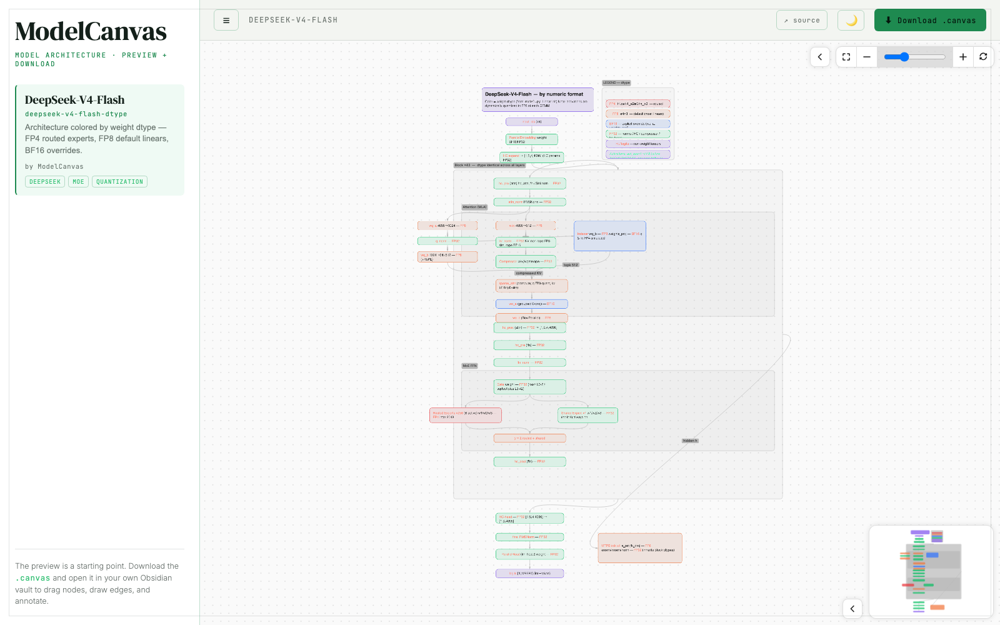

<div align="center">

# ModelCanvas

### A community catalog of model-architecture diagrams — preview in your browser, download for your note editor.

[](./CONTRIBUTING.md)
[](https://jsoncanvas.org/)
[](https://vercel.com/)
[](#how-it-works)

<br/>



<br/>
<br/>

**[Live demo →](https://modelcanvas.vercel.app)** · **[Contribute a diagram →](./CONTRIBUTING.md)**

<sub>↑ replace with your own Vercel URL after deploying</sub>

</div>

---

## What is this?

Model architectures are easiest to *understand* when you can **wrestle with the diagram yourself** —
drag nodes around, draw your own edges, scribble notes on top. That happens best in a canvas-capable
note editor (for example [Obsidian](https://obsidian.md/)), not in a locked-down web widget.

So ModelCanvas keeps the web side deliberately thin: **browse and preview** diagrams here, then
**download the `.canvas`** and make it yours in your own notes. The diagram we ship is a starting
point to think with, not a finished poster.

## Features

- 🗺️ **Browse a catalog** of model-architecture diagrams with pan / zoom / minimap / fullscreen.
- ⬇️ **Download any `.canvas`** and open it in your note editor (e.g. Obsidian) to edit, re-layout, and annotate.
- 🌗 **Light / dark** theme, responsive, collapsible sidebar.
- 🔗 **Shareable deep links** — `?model=<id>` opens straight to a diagram.
- 🤝 **Community-driven** — add a model with a single Pull Request. No code, no merge conflicts.
- ⚡ **Zero backend** — pure static site, free hosting, no secrets.

## Contribute a diagram

Adding a model is **one folder in a Pull Request** — you never touch any web or JavaScript code.

```bash
cp -r models/_template models/your-model-id
# drop your diagram in as model.canvas, fill in meta.json, open a PR
```

```jsonc
// models/your-model-id/meta.json
{
  "name": "Your Model",
  "description": "What the diagram shows and how to read it.",
  "author": { "name": "You", "github": "your-handle" },
  "tags": ["family", "topic"],
  "source": "https://link-to-paper-or-repo"
}
```

A maintainer reviews it (Vercel posts a live preview on the PR), merges, and the site redeploys
automatically. **Full guide → [`CONTRIBUTING.md`](./CONTRIBUTING.md).**

## Run locally

```bash
npm run serve     # builds the catalog, then serves http://localhost:8000
```

Needs Node 18+ and Python 3 — **no npm dependencies to install**.

## How it works

```
models/<id>/ { model.canvas, meta.json }     ← source of truth (your PRs)
        │   scripts/build-catalog.mjs  (validate + generate)
        ▼
web/catalog.json + web/canvases/             ← built in CI, never committed
        │   fetched at runtime
        ▼
web/  static site  →  json-canvas-viewer (CDN)  →  preview + download
```

`models/` is the only thing contributors edit. CI validates every submission and Vercel regenerates
the catalog on each deploy — which is why two people adding different models never conflict.

## Built with

- [json-canvas-viewer](https://github.com/hesprs/json-canvas-viewer) by Hesprs (MIT) — renders the JSON Canvas spec
- [JSON Canvas](https://jsoncanvas.org/) — the open `.canvas` format (used by note editors like Obsidian)

<div align="center"><sub>Made for people who learn by drawing on the diagram.</sub></div>
