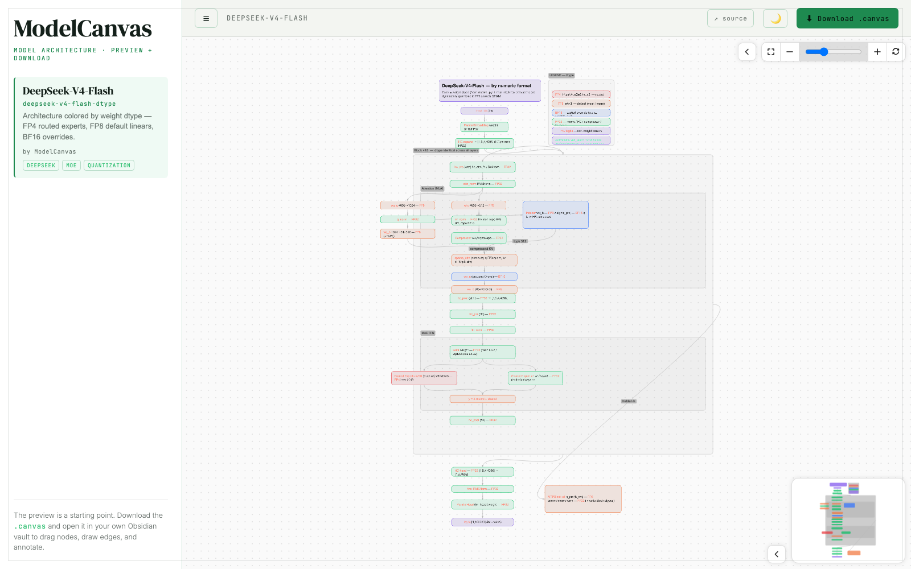

<div align="center">

# ModelCanvas

### A community catalog of model-architecture diagrams — preview in your browser, download for your note editor.

[](./CONTRIBUTING.md)
[](https://jsoncanvas.org/)
[](https://vercel.com/)
[](#how-it-works)

<br/>



<br/>
<br/>

**[Live demo →](https://model-architecture-canvas.vercel.app)** · **[Contribute a diagram →](./CONTRIBUTING.md)**

</div>

---

## What is this?

Model architectures are easiest to *understand* when you can **wrestle with the diagram yourself** —
drag nodes around, draw your own edges, scribble notes on top. That happens best in a canvas-capable
note editor (for example [Obsidian](https://obsidian.md/)), not in a locked-down web widget.

So ModelCanvas keeps the web side deliberately thin: **browse and preview** diagrams here, then
**download the `.canvas`** and make it yours in your own notes. The diagram we ship is a starting
point to think with, not a finished poster.

## Features

- 🗺️ **Browse a catalog** of model-architecture diagrams with pan / zoom / minimap / fullscreen.
- ✏️ **Edit in the browser** — drag, add nodes, draw edges, resize, recolor, delete, and edit text, then download the result. Fully client-side; nothing is saved server-side.
- ⬇️ **Download any `.canvas`** and open it in your note editor (e.g. Obsidian) to edit, re-layout, and annotate.
- 🖼️ **Gallery landing** — browse all models as a responsive grid; click one to open its full canvas.
- 🧊 **Hardware in 3D** — explore GPU chips (NVIDIA B200, H200) as interactive 3D models: rotate, zoom, explode the package into layers, click any part for specs with sources, drill into an SM, and play a guided "how a matmul flows through the chip" walkthrough.
- ⚖️ **Compare two chips** — `hardware/?compare=h200,b200`: a sourced spec table with ratios, the parts that exist in only one chip (e.g. Tensor Memory, the die-to-die link), and two synced 3D views playing the same data-path walkthrough side by side.
- 🛠️ **Edit chips visually** — move/resize parts with a gizmo, edit specs and walkthrough steps, undo/redo, then download `chip.json`. Every chip also gets a generated 2D `.canvas`.
- 🌗 **Light / dark** theme (dark by default), shared across gallery, viewer, and editor.
- 🔗 **Shareable deep links** — `?model=<id>` opens straight to a diagram.
- 🤝 **Community-driven** — add a model with a single Pull Request. No code, no merge conflicts.
- ⚡ **Zero backend** — pure static site, free hosting, no secrets.

## Contribute a diagram

Adding a model is **one folder in a Pull Request** — you never touch any web or JavaScript code.

```bash
cp -r models/_template models/your-model-id
# drop your diagram in as model.canvas, fill in meta.json, open a PR
```

```jsonc
// models/your-model-id/meta.json
{
  "name": "Your Model",
  "description": "What the diagram shows and how to read it.",
  "author": { "name": "You", "github": "your-handle" },
  "tags": ["family", "topic"],
  "source": "https://link-to-paper-or-repo"
}
```

Adding a **chip** works the same way: copy `hardware/_template/` to `hardware/<chip-id>/`, edit
`chip.json` (component tree, illustrative 3D geometry, specs with sources, walkthrough steps) and
`meta.json` — or build it visually in the 3D editor and download the JSON. Schema: [`hardware/_template/README.md`](./hardware/_template/README.md).

A maintainer reviews it (Vercel posts a live preview on the PR), merges, and the site redeploys
automatically. **Full guide → [`CONTRIBUTING.md`](./CONTRIBUTING.md).**

## Run locally

```bash
npm install       # first time only
npm run serve     # builds catalog + editor, then serves http://localhost:8000
npm run dev:editor  # optional: hot-reloading editor dev server
```

Needs Node 18+ and Python 3. The **viewer** is dependency-free static files; the **editor** is a small
React/Vite app (the only npm dependencies) built into `web/editor/`.

## How it works

```
models/<id>/ { model.canvas, meta.json }     ← source of truth (your PRs)
hardware/<id>/ { chip.json, meta.json }      ← chips: validated, 2D .canvas generated
        │   scripts/build-catalog.mjs  +  vite build   (validate + generate)
        ▼
web/catalog.json + canvases/ + editor/ + hardware/ + hardware-data/   ← built in CI, never committed
        │   fetched at runtime
        ▼
web/  static site
   ├─ json-canvas-viewer (CDN)  →  catalog preview + download
   ├─ /editor/  React Flow app  →  in-browser edit + download (client-side, no DB)
   └─ /hardware/  React Three Fiber app  →  3D chip explorer + visual chip editor
```

`models/` is the only thing contributors edit. CI validates every submission, builds the editor, and
Vercel regenerates everything on each deploy — which is why two people adding different models never conflict.

> **Design note:** the viewer started as a deliberately thin "preview + download, edit in your note
> editor" surface. In-browser editing was added later by request — it's an optional convenience layered
> on top; the download-to-Obsidian flow remains first-class.

## Built with

- [json-canvas-viewer](https://github.com/hesprs/json-canvas-viewer) by Hesprs (MIT) — renders the catalog preview
- [React Flow](https://reactflow.dev/) (`@xyflow/react`, MIT) — powers the in-browser editor
- [three.js](https://threejs.org/) + [React Three Fiber](https://r3f.docs.pmnd.rs/) / drei (MIT) — power the 3D hardware explorer
- [JSON Canvas](https://jsoncanvas.org/) — the open `.canvas` format (used by note editors like Obsidian)

<div align="center"><sub>Made for people who learn by drawing on the diagram.</sub></div>
